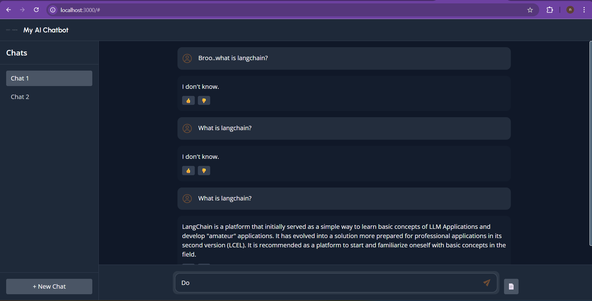

# Document QA RAG System 📚🤖

A sophisticated **Retrieval-Augmented Generation (RAG)** system that enables intelligent question-answering over your documents. Upload PDFs, ask questions, and get accurate, context-aware responses powered by OpenAI's GPT models and ChromaDB vector storage.



## ✨ Features

### 🔍 **Intelligent Document Processing**

- **PDF Upload & Processing**: Upload multiple PDF documents for analysis
- **Automatic Text Extraction**: Extract and chunk text content intelligently
- **Vector Embeddings**: Generate semantic embeddings using OpenAI's embedding models
- **ChromaDB Storage**: Efficient vector storage and similarity search

### 💬 **Advanced Chat Interface**

- **Multi-Session Support**: Create and manage multiple chat sessions
- **Streaming Responses**: Real-time streaming of AI responses
- **Chat History**: Persistent conversation history across sessions
- **Context-Aware Answers**: Responses based on uploaded documents with chat history context

### 📊 **Feedback & Analytics**

- **Thumbs Up/Down Feedback**: Rate AI responses for quality tracking
- **Run ID Tracking**: Unique identifiers for each interaction
- **Comprehensive Logging**: Detailed logs for QA interactions and feedback
- **Performance Monitoring**: Track system performance and user satisfaction

### 🎨 **Modern UI/UX**

- **Dark Theme Interface**: Sleek, modern dark theme design
- **Responsive Design**: Works seamlessly on desktop and mobile
- **Real-time Updates**: Live response streaming with loading indicators
- **Intuitive Navigation**: Clean sidebar with session management

## 🏗️ Architecture

```
Frontend (React + Vite)     Backend (FastAPI)          Storage
┌─────────────────────┐    ┌─────────────────────┐    ┌─────────────────────┐
│                     │    │                     │    │                     │
│  • React Components │    │  • FastAPI Routes   │    │  • SQLite (Chat)    │
│  • Tailwind CSS    │◄──►│  • LangChain        │◄──►│  • ChromaDB (Vector)│
│  • SSE Streaming    │    │  • OpenAI LLM       │    │  • JSON Logs        │
│  • State Management │    │  • Document Loaders │    │                     │
│                     │    │                     │    │                     │
└─────────────────────┘    └─────────────────────┘    └─────────────────────┘
```

## 🚀 Quick Start

### Prerequisites

- **Python 3.11+**
- **Node.js 18+**
- **OpenAI API Key**

### 1. Clone the Repository

```bash
git clone https://github.com/Dev-Nitya/document-qa-rag.git
cd document-qa-rag
```

### 2. Backend Setup

```bash
# Navigate to backend directory
cd backend

# Create virtual environment
python -m venv .venv
.venv\Scripts\activate  # Windows
# source .venv/bin/activate  # Linux/Mac

# Install dependencies
pip install -r requirements.txt

# Create .env file
echo "OPENAI_API_KEY=your_openai_api_key_here" > app/.env

# Initialize database
cd ..
python recreate_db.py

# Start backend server
cd backend
uvicorn app.main:app --reload --host 0.0.0.0 --port 8000
```

### 3. Frontend Setup

```bash
# Open new terminal and navigate to frontend
cd frontend

# Install dependencies
npm install

# Create environment file
echo "VITE_API_URL=http://localhost:8000" > .env

# Start development server
npm run dev
```

### 4. Access the Application

- **Frontend**: http://localhost:5173
- **Backend API**: http://localhost:8000
- **API Documentation**: http://localhost:8000/docs

## 🛠️ Technology Stack

### Frontend

- **React 19** - Modern UI library
- **Vite** - Fast build tool and dev server
- **Tailwind CSS** - Utility-first CSS framework
- **React Markdown** - Markdown rendering
- **UUID** - Unique identifier generation

### Backend

- **FastAPI** - Modern, fast web framework
- **LangChain** - LLM application framework
- **OpenAI GPT** - Language model for responses
- **ChromaDB** - Vector database for embeddings
- **SQLAlchemy** - Database ORM
- **SQLite** - Lightweight database

### AI & ML

- **OpenAI Embeddings** - Text vectorization
- **LangChain Document Loaders** - PDF processing
- **Retrieval-Augmented Generation** - RAG implementation

## 📁 Project Structure

```
document-qa-rag/
├── backend/
│   ├── app/
│   │   ├── chains/          # LangChain implementations
│   │   ├── models/          # Database models
│   │   ├── routes/          # API endpoints
│   │   ├── utils/           # Utility functions
│   │   ├── loaders/         # Document processing
│   │   └── main.py          # FastAPI application
│   └── requirements.txt
├── frontend/
│   ├── src/
│   │   ├── components/      # React components
│   │   ├── hooks/           # Custom React hooks
│   │   └── assets/          # Static assets
│   ├── package.json
│   └── vite.config.js
├── data/
│   └── sample_docs/         # Sample PDF documents
├── chroma_db/               # Vector database storage
├── screenshots/             # Application screenshots
└── README.md
```

## 🔧 Configuration

### Environment Variables

#### Backend (.env in backend/app/)

```env
OPENAI_API_KEY=your_openai_api_key_here
```

#### Frontend (.env in frontend/)

```env
VITE_API_URL=http://localhost:8000
```

## 📊 API Endpoints

### Core Endpoints

- `POST /ask` - Ask questions about documents
- `POST /upload` - Upload PDF documents
- `POST /chat` - Create new chat sessions
- `POST /feedback` - Submit response feedback

### Documentation

- `GET /docs` - Interactive API documentation
- `GET /redoc` - Alternative API documentation

## 🎯 Usage Examples

### 1. Upload a Document

```javascript
const formData = new FormData();
formData.append("file", pdfFile);
formData.append("session_id", sessionId);

const response = await fetch("/upload", {
  method: "POST",
  body: formData,
});
```

### 2. Ask a Question

```javascript
const response = await fetch("/ask", {
  method: "POST",
  headers: { "Content-Type": "application/json" },
  body: JSON.stringify({
    question: "What is the main topic of the document?",
    session_id: sessionId,
  }),
});
```

### 3. Submit Feedback

```javascript
await fetch("/feedback", {
  method: "POST",
  headers: { "Content-Type": "application/json" },
  body: JSON.stringify({
    session_id: sessionId,
    question: "What is...?",
    answer: "The answer is...",
    feedback: "thumbs_up",
    run_id: runId,
  }),
});
```

## 🚦 Development

### Running Tests

```bash
# Backend tests
cd backend
python -m pytest

# Frontend tests
cd frontend
npm run test
```

### Database Management

```bash
# Recreate database with latest schema
python recreate_db.py

# Reset vector database
rm -rf chroma_db/
```

## 📈 Performance Optimization

- **Streaming Responses**: Real-time response streaming for better UX
- **Vector Indexing**: Efficient similarity search with ChromaDB
- **Session Management**: Persistent chat history
- **Chunking Strategy**: Optimized text chunking for better retrieval

## 🤝 Contributing

1. Fork the repository
2. Create a feature branch (`git checkout -b feature/amazing-feature`)
3. Commit your changes (`git commit -m 'Add amazing feature'`)
4. Push to the branch (`git push origin feature/amazing-feature`)
5. Open a Pull Request

## 📄 License

This project is licensed under the MIT License - see the [LICENSE](LICENSE) file for details.

## 🎉 Acknowledgments

- OpenAI for providing excellent language models
- LangChain for the powerful RAG framework
- ChromaDB for efficient vector storage
- FastAPI for the modern web framework

---

Made with ❤️ by [Dev-Nitya](https://github.com/Dev-Nitya)
